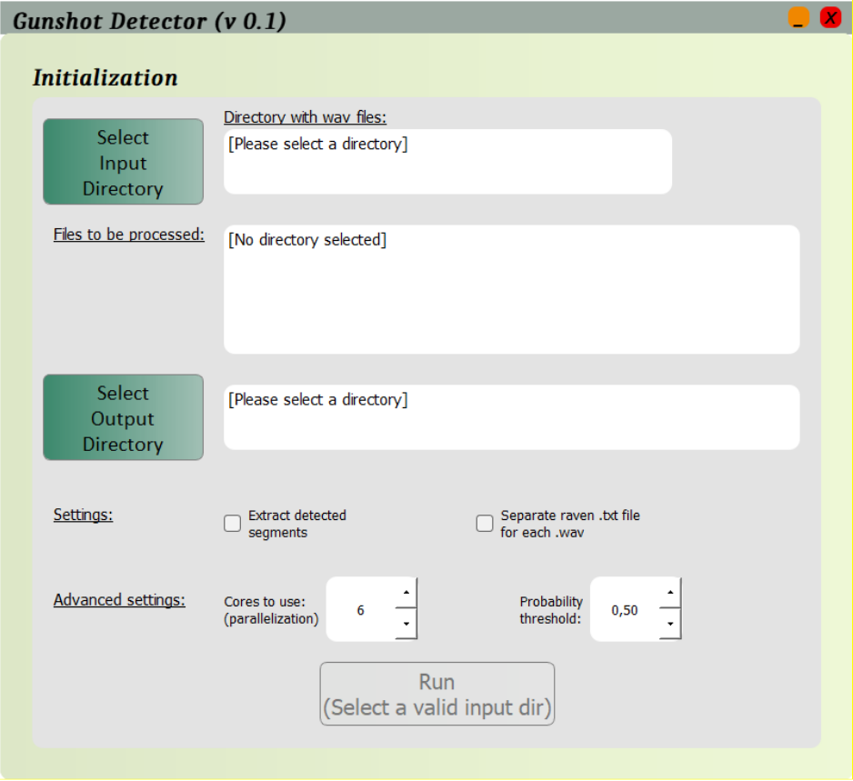
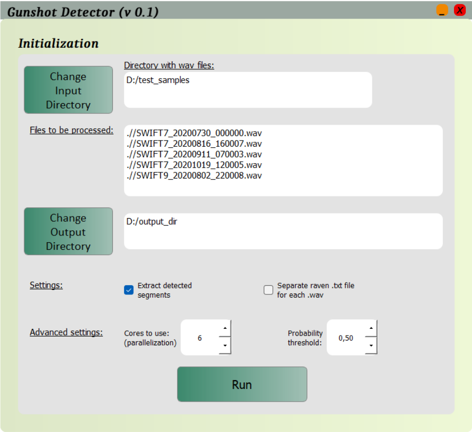
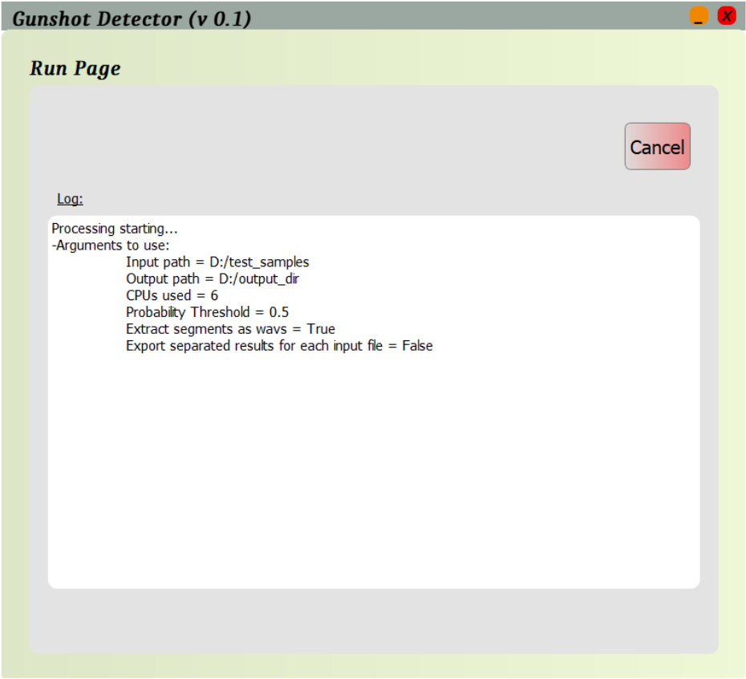
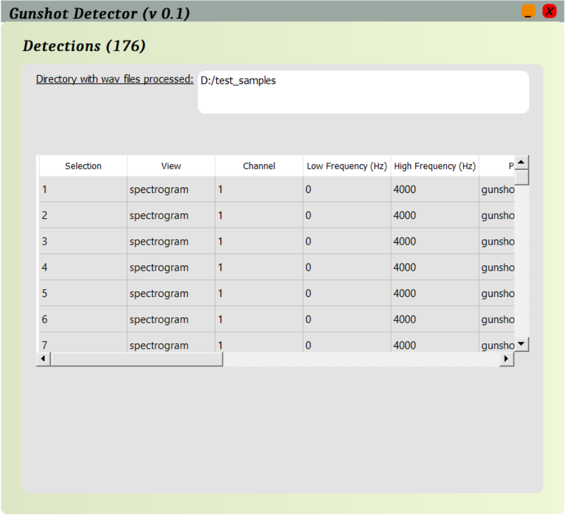

# GUNSHOT
BLABLA description

[konpsar](https://github.com/konpsar)

## Installation

1. Create a new `python 3.8` environment.

2. Install required packages. 

    ```bash
    cd setup
    pip install -r requirements.txt
    cd ..
    ```

3. Validate packages installation. 

    ```bash
    python3 setup/check_lids.py
    ```
    If everything is installed correctly the message  `Everything works fine!` will be printed.

## Running the Tool

1. Activate python environment.

2. Execute `gui.py` file.

    `python3 gui.py`



### Configurations/Directories/Settings

All available settings are shown on the first page of the GUI.

#### Mandatory Settings

- **Input Directory**

  Click "Select Input Directory" button and navigate to the folder that contains the wav files for the analysis. When a folder with wav files is selected, the wav files that are going to go through the analysis are shown in the “Files to be processed” text box.

- **Output Directory**

#### Optional Settings 

- **Extract detected segments** 

  Option to export the wav files of the segments that were detected during the  detection and classification procedure. If we want to extract them, we just check the corresponding checkbox.

- **Separate raven .txt file for each .wav** 

  Option to export the raven compatible results files one per file, instead of one per analysis. If we want to extract one raven compatible .txt and .xlsx per input recording, then we can just check the corresponding checkbox. 

- **Cores to use**

  Number of CPUs to be used. For example, if we want to engage 4 CPUs, we can 
type 4 or change the spinbox value through the up/down buttons. The available  values is 1 through <MAX_CPUS> where <MAX_CPUS> is the maximum 
processing units that the CPU in the system running the gui has. By default, the 75% of the available CPUs will be used. 

- **Probability threshold**

  Classifier's probability threshold. After classification, each event is given a probability of being a gunshot. If the probability of an event is greater or equal to this threshold then the event will be considered as gunshot. For example, if we want to set a probability threshold equal to 0.3, we can type 0.3 or change the spinbox value through the up/down buttons. This parameter can take values from 0.01 to 0.99. By default, a probability threshold equal to 0.5will be used.

After selecting all the desired directories and parameters, RUN button will become available:



By clicking run, next screen of the GUI will be shown, where you can initially see the parameters that will be used for the analysis, and when the procedure starts, you can follow the execution of the algorithm (by reading the log as execution proceeds), or Cancel it if desired.



When the execution reaches the end (all input files have been processed), the results screen is shown, where you can see the raven compatible detections table that is also exported in the output/results folder.



### Results

In the corresponding output folder, you can find:

- **`detections`**: A folder where some intermediate files of the analysis are saved, in order to skip the first part of the algorithm if the same files are analyzed again with a different probability threshold.

  - In case you have selected to also export wav audio files for each detection segment, a folder `extracted_segments` where all the segments that have been detected and classified as gunshots are saved in .wav format.

  - In case you haven’t selected to export separated Raven compatible files for each input recording:
    - `Results_raven.txt`: Detections table compatible with Raven
    - `Results_raven.xlsx`: Detections table in an Excel file format

  - In case you have selected to export separated Raven compatible files for each input recording, one more subfolder will be created with the title `separated_results`, where all the exported Raven compatible files will be extracted.

- **Analysis_report_XXXXXX_XXXXXX.txt**: A report of the analysis which contains all the important information about the parameters used, the files analyzed, and the exported files.


> :warning: Important note: In case you re-run the algorithm with the same input folder (e.g. with a different probability threshold), all previous exported segments will be deleted and only the new ones will be kept. The rest of the files won’t be deleted.